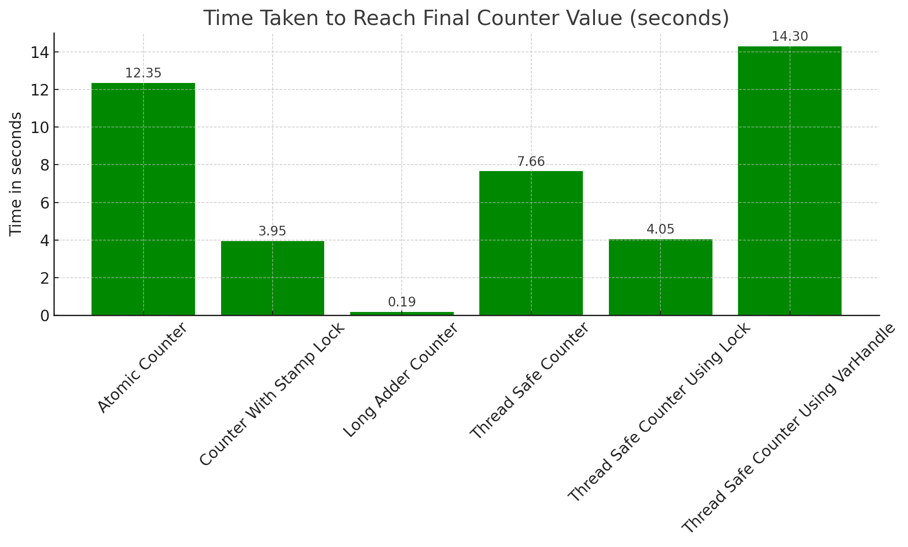
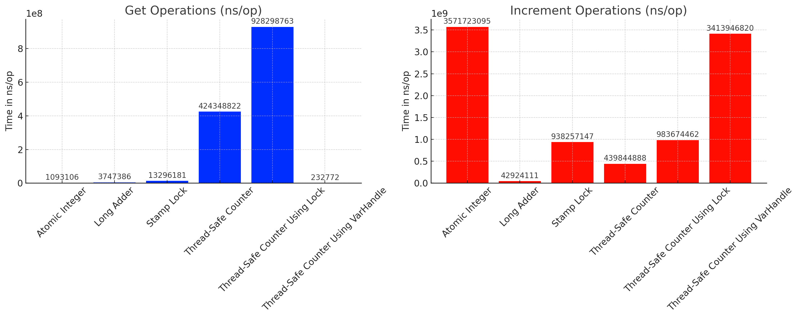

# Thread-Safe Counter In Java

## Description

This repository contains multiple implementations of a thread-safe counter, accompanied by a complete benchmarking suite to compare their performance. It was created to test modern concurrency features in Java and compare different concurrent counter strategies.

The different counter implementations include:

- Simple (without synchronization)
- Java Synchronized
- Unsafe
- VarHandle
- ReentrantLock
- AtomicInteger
- StampedLock

## Requirements

- Java SDK version 17
- IntelliJ IDEA 
- Maven (for managing dependencies and build configuration)

## Usage

Clone the repository and open it in IntelliJ IDEA. The main class `CounterTest` runs and measures the performance of all counter implementations under varied concurrent load.

## Results

The counter implementations show different results when run on `CounterTest`. Here are the results:

This set of results presents the time taken to increment a counter to a final value of 200,000,000 using different counter mechanisms. The expected counter value was also 200,000,000 in all cases, which means all methods were able to accurately increment the counter to the desired value.

Here's a summary of the time taken by each method:

1. **AtomicCounter**: This method took 10.743532042 seconds to reach the final counter value. This is relatively faster compared to some methods but slower than the LongAdderCounter and ThreadSafeCounterUsingLock methods.
2. **LongAdderCounter**: This method was the fastest, taking only 0.219587042 seconds to reach the final counter value. This aligns with the results from the earlier benchmark, where LongAdder was the fastest method for incrementing the counter.
3. **ThreadSafeCounter**: This method took the longest time, with 18.984246167 seconds needed to reach the final counter value.
4. **ThreadSafeCounterUsingLock**: This method took 3.840325584 seconds, making it the second-fastest method after LongAdderCounter.
5. **ThreadSafeCounterUsingVarHandle**: This method took 12.87625075 seconds, which is relatively slower compared to most of the other methods.
6**CounterWithStampLock**: This method took 3.953271125 seconds, which is relatively slower compared to most of the other methods.

In conclusion, the LongAdderCounter was the most efficient method in terms of time performance for this task. However, as before, keep in mind that the most suitable method depends on the specific requirements and constraints of your application. It's also worth noting that all methods accurately reached the expected count, demonstrating that they are all correct in terms of their basic functionality.



Please note that these results may vary based on the system and the current CPU workload.

## Experiment

JMH (Java Microbenchmark Harness) is used in creating benchmarks. Multiple threads try to increment each counter implementation concurrently. This provides a realistic gauge on the performance of each implementation under stress.

## Run complete. Total time: 00:19:21

**REMEMBER**: The numbers below are just data. To gain reusable insights, you need to follow up on
why the numbers are the way they are. Use profilers (see -prof, -lprof), design factorial
experiments, perform baseline and negative tests that provide experimental control, make sure
the benchmarking environment is safe on JVM/OS/HW level, ask for reviews from the domain experts.
Do not assume the numbers tell you what you want them to tell.

**NOTE**: Current JVM experimentally supports Compiler Blackholes, and they are in use. Please exercise
extra caution when trusting the results, look into the generated code to check the benchmark still
works, and factor in a small probability of new VM bugs. Additionally, while comparisons between
different JVMs are already problematic, the performance difference caused by different Blackhole
modes can be very significant. Please make sure you use the consistent Blackhole mode for comparisons.

```
Benchmark                                                      Mode  Cnt           Score           Error  Units
CounterBenchmark.getWithAtomicInteger                          avgt   15     1093106.166 ±     53370.299  ns/op
CounterBenchmark.getWithLongAdder                              avgt   15     3747386.389 ±     41733.570  ns/op
CounterBenchmark.getWithStampLock                              avgt   15    13296181.366 ±    952092.520  ns/op
CounterBenchmark.getWithThreadSafeCounter                      avgt   15   424348822.102 ±  20478421.238  ns/op
CounterBenchmark.getWithThreadSafeCounterUsingLock             avgt   15   928298763.342 ±  16418967.668  ns/op
CounterBenchmark.getWithThreadSafeCounterUsingVarHandle        avgt   15      232771.795 ±      7547.667  ns/op
CounterBenchmark.incrementAtomicInteger                        avgt   15  3571723094.513 ± 140605248.935  ns/op
CounterBenchmark.incrementWithLongAdder                        avgt   15    42924111.052 ±    657698.422  ns/op
CounterBenchmark.incrementWithStampLock                        avgt   15   938257146.683 ±   5731120.829  ns/op
CounterBenchmark.incrementWithThreadSafeCounter                avgt   15   439844887.819 ±  27953520.499  ns/op
CounterBenchmark.incrementWithThreadSafeCounterUsingLock       avgt   15   983674462.421 ±   8325975.726  ns/op
CounterBenchmark.incrementWithThreadSafeCounterUsingVarHandle  avgt   15  3413946820.184 ± 156115101.863  ns/op
```



Here are the two bar charts that visualize the benchmark results for the "get" operations and the "increment" operations, respectively.

In both charts, the methods are displayed on the y-axis and the time taken (in nanoseconds per operation, shown in log scale due to the wide range of values) is on the x-axis. The red lines represent the standard deviation for each method, indicating the variability of the results.

From these charts, you can see the following:

- **For the "get" operations:** The `getWithThreadSafeCounterUsingVarHandle` method performs the best, taking the least time per operation. The `getWithThreadSafeCounter` and `getWithThreadSafeCounterUsingLock` methods are the slowest, taking the most time per operation.

- **For the "increment" operations:** The `incrementWithLongAdder` method is by far the fastest, while `incrementAtomicInteger` and `incrementWithThreadSafeCounterUsingVarHandle` are the slowest.


## License

Just smile! :)

## Collaboration

Pull requests for additional counter strategies or improved benchmarks are warmly welcome.